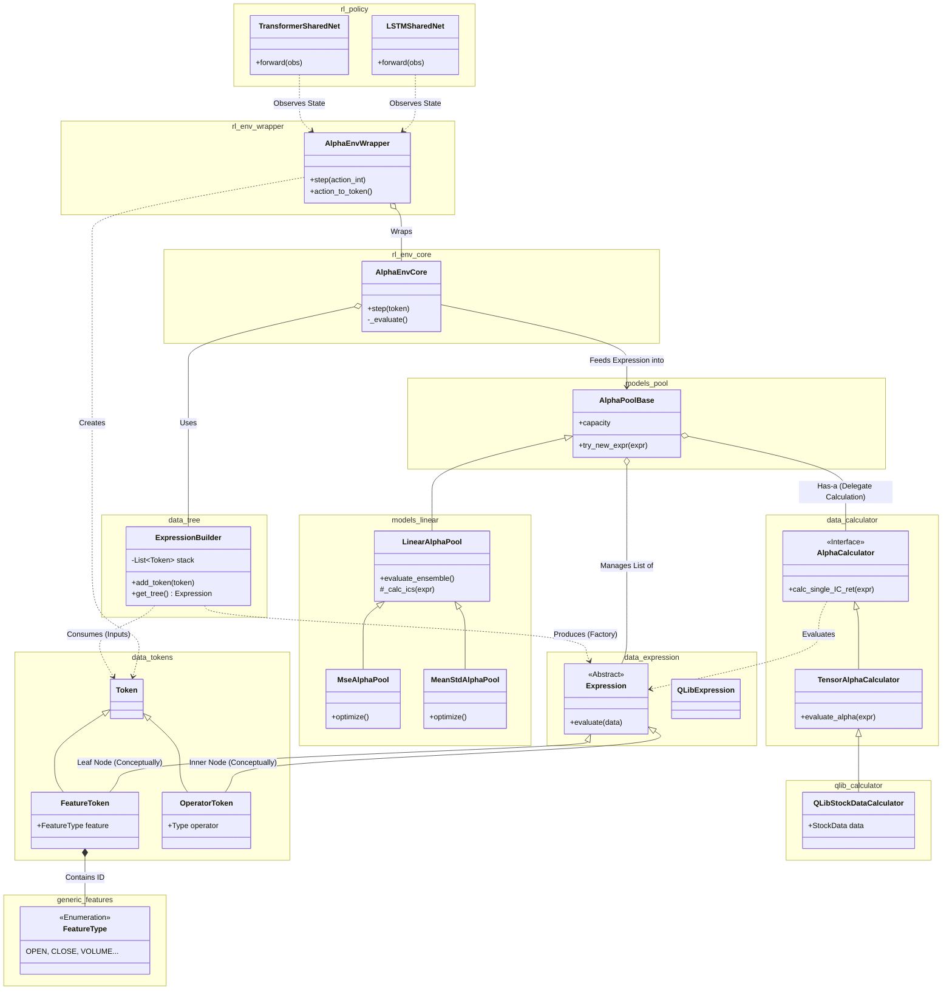

```mermaid
classDiagram
    %% ======================================================================================
    %% LAYER 1: 基础数据结构与表达式树 (Data Structure Layer)
    %% 描述：因子是如何由底层的 Feature 和 Operator 堆叠成树状结构的
    %% ======================================================================================
    
    namespace data_tokens {
        class Token {
            %% filepath: alphagen/data/tokens.py
        }
        class FeatureToken {
            %% filepath: alphagen/data/tokens.py
            +FeatureType feature
        }
        class OperatorToken {
            %% filepath: alphagen/data/tokens.py
            +Type operator
        }
    }

    namespace data_expression {
        class Expression {
            %% filepath: alphagen/data/expression.py
            <<Abstract>>
            +evaluate(data)
        }
        class QLibExpression {
            %% filepath: alphagen_qlib/expression.py
            %% (注: 实际运算逻辑在 alphagen_qlib 中扩展)
        }
    }

    namespace data_tree {
        class ExpressionBuilder {
            %% filepath: alphagen/data/tree.py
            -List~Token~ stack
            +add_token(token)
            +get_tree() Expression
        }
    }

    namespace generic_features {
        class FeatureType {
            %% filepath: alphagen_qlib/stock_data.py
            <<Enumeration>>
            OPEN, CLOSE, VOLUME...
        }
    }

    %% [关系 - 构造]
    Token <|-- FeatureToken
    Token <|-- OperatorToken
    FeatureToken *-- FeatureType : Contains ID
    
    %% [关系 - 树生成]
    ExpressionBuilder ..> Token : Consumes (Inputs)
    ExpressionBuilder ..> Expression : Produces (Factory)
    
    %% [关系 - 树结构]
    %% 这里的逻辑是：一个 Expression 实质上是由 Feature 和 Operator 组成的树
    Expression <|-- FeatureToken : Leaf Node (Conceptually)
    Expression <|-- OperatorToken : Inner Node (Conceptually)


    %% ======================================================================================
    %% LAYER 2: 核心业务逻辑与计算 (Core Business Layer)
    %% 描述：产生的 Expression 树被送往哪里，如何被计算，如何被管理
    %% ======================================================================================

    namespace data_calculator {
        class AlphaCalculator {
            %% filepath: alphagen/data/calculator.py
            <<Interface>>
            +calc_single_IC_ret(expr)
        }
        class TensorAlphaCalculator {
            %% filepath: alphagen/data/calculator.py
            +evaluate_alpha(expr)
        }
    }
    
    namespace qlib_calculator {
        class QLibStockDataCalculator {
            %% filepath: alphagen_qlib/calculator.py
            +StockData data
        }
    }

    namespace models_pool {
        class AlphaPoolBase {
            %% filepath: alphagen/models/alpha_pool.py
            +capacity
            +try_new_expr(expr)
        }
    }

    namespace models_linear {
        class LinearAlphaPool {
            %% filepath: alphagen/models/linear_alpha_pool.py
            +evaluate_ensemble()
            #_calc_ics(expr)
        }
        class MseAlphaPool {
            %% filepath: alphagen/models/linear_alpha_pool.py
            +optimize()
        }
        class MeanStdAlphaPool {
            %% filepath: alphagen/models/linear_alpha_pool.py
            +optimize()
        }
    }

    %% [关系 - 计算]
    AlphaCalculator <|-- TensorAlphaCalculator
    TensorAlphaCalculator <|-- QLibStockDataCalculator
    
    %% 计算器依赖 Expression 进行求值
    AlphaCalculator ..> Expression : Evaluates

    %% [关系 - 因子池]
    AlphaPoolBase <|-- LinearAlphaPool
    LinearAlphaPool <|-- MseAlphaPool
    LinearAlphaPool <|-- MeanStdAlphaPool
    
    %% 因子池持有计算器
    AlphaPoolBase o-- AlphaCalculator : Has-a (Delegate Calculation)
    %% 因子池管理表达式列表
    AlphaPoolBase o-- Expression : Manages List of


    %% ======================================================================================
    %% LAYER 3: 强化学习控制层 (RL Control Layer)
    %% 描述：Agent 如何观察状态，通过 Wrapper 和 Core 驱动上述逻辑
    %% ======================================================================================

    namespace rl_env_core {
        class AlphaEnvCore {
            %% filepath: alphagen/rl/env/core.py
            +step(token)
            -_evaluate()
        }
    }

    namespace rl_env_wrapper {
        class AlphaEnvWrapper {
            %% filepath: alphagen/rl/env/wrapper.py
            +step(action_int)
            +action_to_token()
        }
    }

    namespace rl_policy {
        class TransformerSharedNet {
            %% filepath: alphagen/rl/policy.py
            +forward(obs)
        }
        class LSTMSharedNet {
            %% filepath: alphagen/rl/policy.py
            +forward(obs)
        }
    }

    %% [关系 - RL 封装]
    AlphaEnvWrapper o-- AlphaEnvCore : Wraps
    
    %% [关系 - 核心流转]
    %% 1. Wrapper 将 int 转为 Token
    AlphaEnvWrapper ..> Token : Creates
    
    %% 2. Core 将 Token 喂给 Builder
    AlphaEnvCore o-- ExpressionBuilder : Uses
    
    %% 3. Core 将生成好的 Expression 喂给 Pool
    AlphaEnvCore --> AlphaPoolBase : Feeds Expression into
    
    %% [关系 - 策略感知]
    TransformerSharedNet ..> AlphaEnvWrapper : Observes State
    LSTMSharedNet ..> AlphaEnvWrapper : Observes State
```