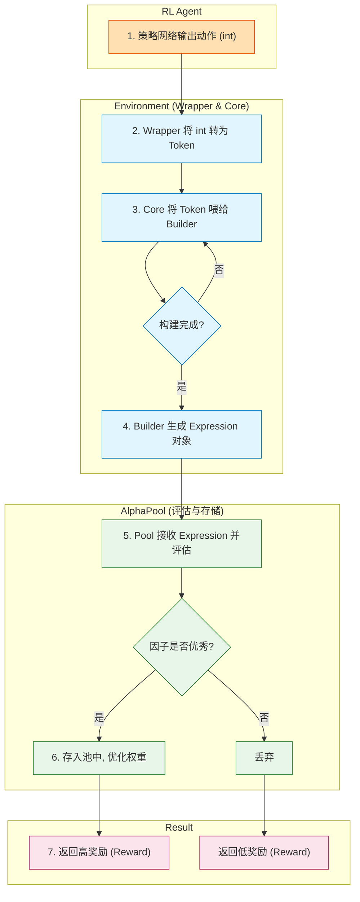

```mermaid
graph TD
    classDef rl fill:#ffe0b2,stroke:#e65100;
    classDef env fill:#e1f5fe,stroke:#0277bd;
    classDef pool fill:#e8f5e9,stroke:#2e7d32;
    classDef result fill:#fce4ec,stroke:#ad1457;

    subgraph "RL Agent"
        A1["1. 策略网络输出动作 (int)"]:::rl
    end

    subgraph "Environment (Wrapper & Core)"
        A1 --> B1["2. Wrapper 将 int 转为 Token"]:::env
        B1 --> B2["3. Core 将 Token 喂给 Builder"]:::env
        B2 --> B3{"构建完成?"}:::env
        B3 -- 否 --> B2
        B3 -- 是 --> B4["4. Builder 生成 Expression 对象"]:::env
    end

    subgraph "AlphaPool (评估与存储)"
        B4 --> C1["5. Pool 接收 Expression 并评估"]:::pool
        C1 --> C2{"因子是否优秀?"}:::pool
        C2 -- 是 --> C3["6. 存入池中, 优化权重"]:::pool
        C2 -- 否 --> C4["丢弃"]:::pool
    end
    
    subgraph "Result"
        C3 --> D1["7. 返回高奖励 (Reward)"]:::result
        C4 --> D2["返回低奖励 (Reward)"]:::result
    end
```