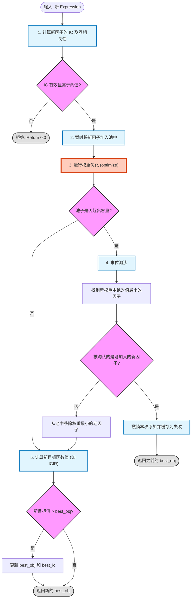

```mermaid
graph TD
    %% 定义节点样式
    classDef decision fill:#f9f,stroke:#333,stroke-width:2px;
    classDef process fill:#e1f5fe,stroke:#0277bd,stroke-width:2px;
    classDef terminator fill:#e0e0e0,stroke:#333,stroke-width:2px;
    classDef critical fill:#ffccbc,stroke:#d84315,stroke-width:4px;

    Start(["输入: 新 Expression"]) --> CalcICs["1. 计算新因子的 IC 及互相关性"]:::process
    
    CalcICs --> CheckValidity{"IC 有效且高于阈值?"}:::decision
    CheckValidity -- 否 --> Reject(["拒绝: Return 0.0"]):::terminator
    
    CheckValidity -- 是 --> AddToPool["2. 暂时将新因子加入池中"]:::process
    
    AddToPool --> Optimize["3. 运行权重优化 (optimize)"]:::critical
    
    Optimize --> CheckCapacity{"池子是否超出容量?"}:::decision
    
    CheckCapacity -- 否 --> CalcObjective["5. 计算新目标函数值 (如 ICIR)"]:::process
    
    CheckCapacity -- 是 --> Pruning["4. 末位淘汰"]:::process
    Pruning --> FindWorst["找到新权重中绝对值最小的因子"]
    FindWorst --> IsNewFactorWorst{"被淘汰的是刚加入的新因子?"}:::decision
    
    IsNewFactorWorst -- 是 --> RevertAndCache["撤销本次添加并缓存为失败"]:::process
    RevertAndCache --> ReturnBestObj(["返回之前的 best_obj"]):::terminator
    
    IsNewFactorWorst -- 否 --> RemoveWorst["从池中移除权重最小的老因子"]
    RemoveWorst --> CalcObjective
    
    CalcObjective --> UpdateBest{"新目标值 > best_obj?"}:::decision
    UpdateBest -- 是 --> SaveNewBest["更新 best_obj 和 best_ic"]
    SaveNewBest --> ReturnNewObj(["返回新的 best_obj"]):::terminator
    
    UpdateBest -- 否 --> ReturnNewObj
```