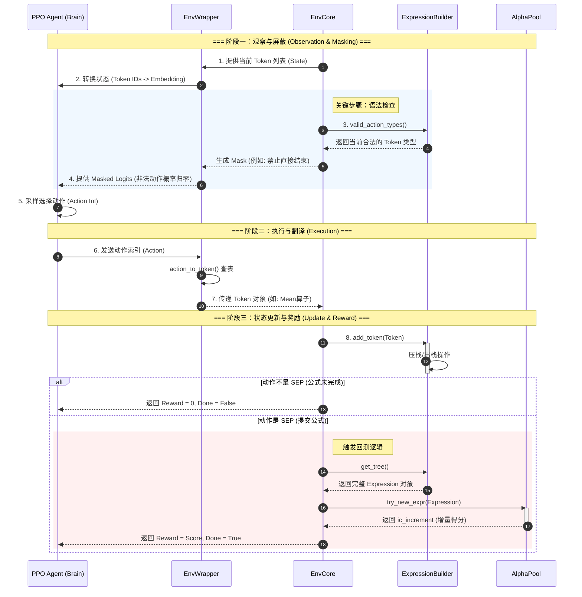

```mermaid
sequenceDiagram
    autonumber
    %% 定义参与者
    participant PPO as PPO Agent (Brain)
    participant Wrapper as EnvWrapper
    participant Core as EnvCore
    participant Builder as ExpressionBuilder
    participant Pool as AlphaPool

    Note over PPO, Pool: === 阶段一：观察与屏蔽 (Observation & Masking) ===

    Core->>Wrapper: 1. 提供当前 Token 列表 (State)
    Wrapper->>PPO: 2. 转换状态 (Token IDs -> Embedding)
    
    rect rgb(240, 248, 255)
        Note right of Core: 关键步骤：语法检查
        Core->>Builder: 3. valid_action_types()
        Builder-->>Core: 返回当前合法的 Token 类型
        Core-->>Wrapper: 生成 Mask (例如: 禁止直接结束)
        Wrapper-->>PPO: 4. 提供 Masked Logits (非法动作概率归零)
    end
    
    PPO->>PPO: 5. 采样选择动作 (Action Int)
    
    Note over PPO, Pool: === 阶段二：执行与翻译 (Execution) ===

    PPO->>Wrapper: 6. 发送动作索引 (Action)
    Wrapper->>Wrapper: action_to_token() 查表
    Wrapper-->>Core: 7. 传递 Token 对象 (如: Mean算子)

    Note over PPO, Pool: === 阶段三：状态更新与奖励 (Update & Reward) ===

    Core->>Builder: 8. add_token(Token)
    activate Builder
    Builder->>Builder: 压栈/出栈操作
    deactivate Builder
    
    alt 动作不是 SEP (公式未完成)
        Core-->>PPO: 返回 Reward = 0, Done = False
    else 动作是 SEP (提交公式)
        rect rgb(255, 240, 240)
            Note right of Core: 触发回测逻辑
            Core->>Builder: get_tree()
            Builder-->>Core: 返回完整 Expression 对象
            Core->>Pool: try_new_expr(Expression)
            activate Pool
            Pool-->>Core: 返回 ic_increment (增量得分)
            deactivate Pool
            Core-->>PPO: 返回 Reward = Score, Done = True
        end
    end
```