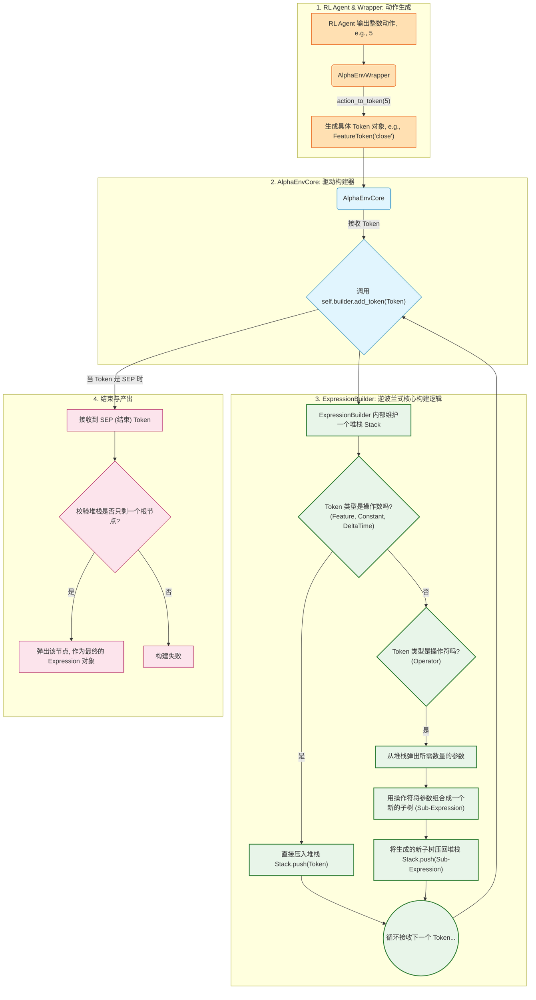

### `Expression` 构建过程详解 (基于逆波兰式)

在 `alphagen` 中，一个因子表达式 (`Expression` 对象) 本质上是一棵树。这个构建过程巧妙地利用了**逆波兰式（Reverse Polish Notation, RPN）** 的思想，其核心是 `alphagen/data/tree.py` 中的 `ExpressionBuilder` 类。

#### 什么是 `Expression` 对象？
`Expression` 是一个抽象基类，代表一个可计算的因子公式。它可以是一个简单的叶子节点（如 `Feature('close')`），也可以是一个复杂的内部节点（如 `Add(Rank(close), Rank(open))`）。每个 `Expression` 对象都知道如何通过 `evaluate()` 方法计算自身的因子值。

---

#### 构建流程：一个具体的例子

假设 RL Agent 依次生成了代表 `close`, `10`, `Mean` 的动作序列。

1.  **起点: 空的 `ExpressionBuilder`**
    *   `ExpressionBuilder` 内部维护一个**堆栈 (Stack)**，此时为空。
    *   `Stack: []`

2.  **第一步: 接收 `FeatureToken('close')`**
    *   `AlphaEnvWrapper` 将 RL 的动作转换为 `FeatureToken('close')`。
    *   `AlphaEnvCore` 将此 `Token` 传递给 `ExpressionBuilder`。
    *   `ExpressionBuilder` 判断出这是一个**操作数** (Operand)。
    *   **操作**: 直接将其压入堆栈。
    *   `Stack: [Feature('close')]`

3.  **第二步: 接收 `ConstantToken(10)`**
    *   同上，`ConstantToken(10)` 是一个**操作数**。
    *   **操作**: 直接压入堆栈。
    *   `Stack: [Feature('close'), Constant(10)]`

4.  **第三步: 接收 `OperatorToken('Mean')`**
    *   `ExpressionBuilder` 判断出这是一个**操作符** (Operator)。`Mean` 是一个二元算子，需要两个参数。
    *   **操作 (规约/Reduce)**:
        1.  从堆栈中**弹出**两个元素：先弹出 `Constant(10)` (作为参数2)，再弹出 `Feature('close')` (作为参数1)。
        2.  用 `Mean` 操作符将这两个参数**组合**成一个新的 `Expression` 子树：`Mean(Feature('close'), Constant(10))`。
        3.  将这个新生成的**子树**压回堆栈。
    *   `Stack: [Mean(Feature('close'), Constant(10))]`

5.  **结束: 接收 `SEP_TOKEN`**
    *   `AlphaEnvCore` 接收到序列结束符。
    *   `ExpressionBuilder` 进行最终校验：
        1.  检查堆栈中是否**只剩下一个元素**。
        2.  检查这个元素是否是一个**合法、完整的表达式树**。
    *   校验通过后，`ExpressionBuilder` 将堆栈中这唯一的元素弹出，作为最终的构建结果返回。
    *   **产出**: `Mean(Feature('close'), Constant(10))` 这个 `Expression` 对象。

这个 `Expression` 对象随后会被送入 `AlphaPool` 进行评估。整个过程就像使用一个老式的堆栈计算器：先输入数字，再输入运算符