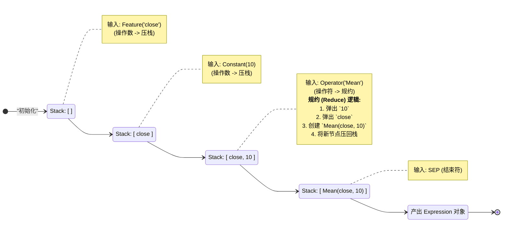

```mermaid
stateDiagram-v2
    direction LR
    
    [*] --> Start: "初始化"
    
    state "Stack: [ ]" as Start
    state "Stack: [ close ]" as S1
    state "Stack: [ close, 10 ]" as S2
    state "Stack: [ Mean(close, 10) ]" as S3
    state "产出 Expression 对象" as Final

    %% 流程连线 (无描述)
    Start --> S1
    S1 --> S2
    S2 --> S3
    S3 --> Final
    Final --> [*]

    %% 使用 Note 对转换进行解释
    note right of Start
        输入: Feature('close')
        (操作数 -> 压栈)
    end note

    note right of S1
        输入: Constant(10)
        (操作数 -> 压栈)
    end note

    note right of S2
        输入: Operator('Mean')
        (操作符 -> 规约)
        **规约 (Reduce) 逻辑:**
        1. 弹出 `10`
        2. 弹出 `close`
        3. 创建 `Mean(close, 10)`
        4. 将新节点压回栈
    end note

    note right of S3
        输入: SEP (结束符)
    end note
```