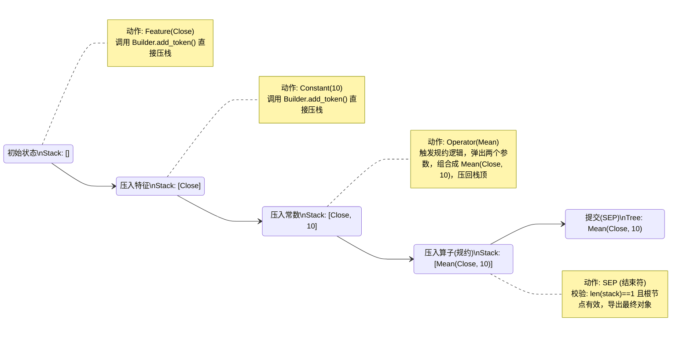

```mermaid
stateDiagram-v2
    direction LR

    %% 定义状态
    state "初始状态\nStack: []" as Start
    state "压入特征\nStack: [Close]" as S1
    state "压入常数\nStack: [Close, 10]" as S2
    state "压入算子(规约)\nStack: [Mean(Close, 10)]" as S3
    state "提交(SEP)\nTree: Mean(Close, 10)" as Final

    %% 流程连线
    Start --> S1
    S1 --> S2
    S2 --> S3
    S3 --> Final

    note right of Start
        动作: Feature(Close)
        调用 Builder.add_token() 直接压栈
    end note

    note right of S1
        动作: Constant(10)
        调用 Builder.add_token() 直接压栈
    end note

    note right of S2
        动作: Operator(Mean)
        触发规约逻辑，弹出两个参数，组合成 Mean(Close, 10)，压回栈顶
    end note

    note right of S3
        动作: SEP (结束符)
        校验: len(stack)==1 且根节点有效，导出最终对象
    end note
```