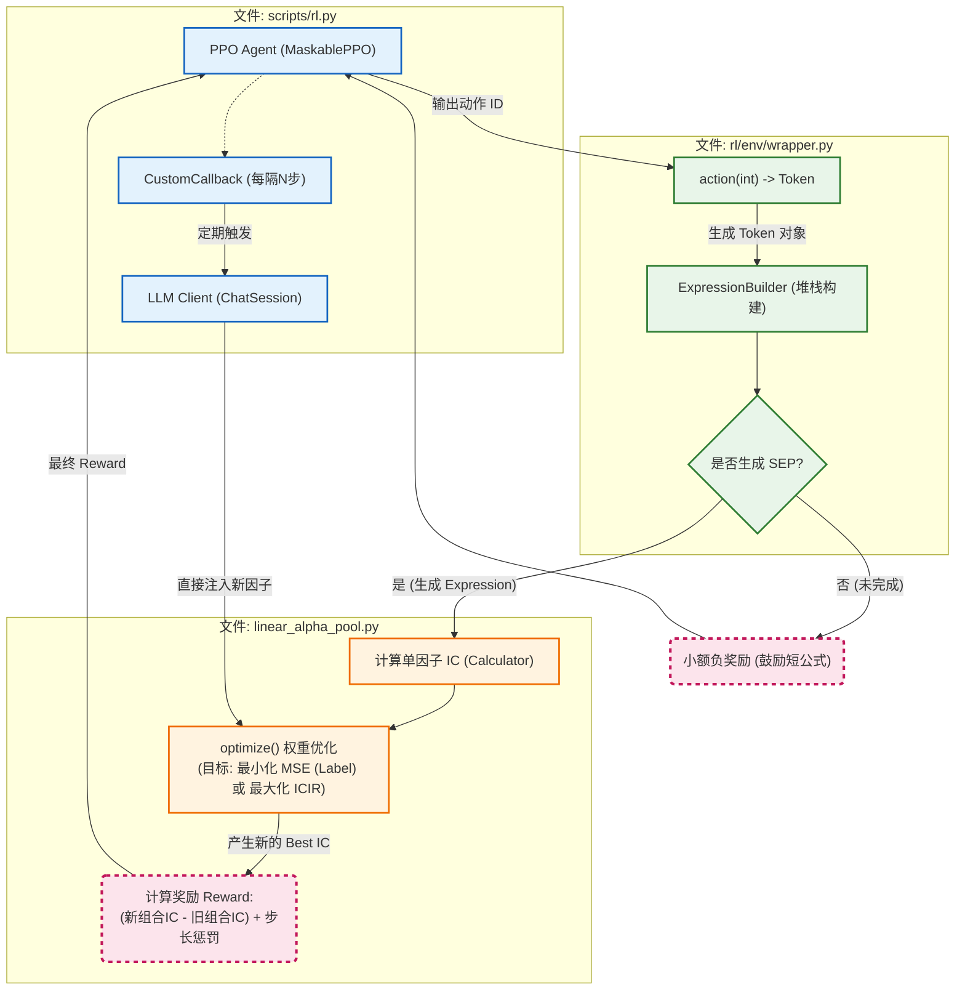

### 核心逻辑说明

1.  **初始化 (Initialization)**:
    *   脚本首先初始化 Qlib 数据加载器 (`QLibStockDataCalculator`)，并将数据划分为训练集（2012-2021）和测试集（2022-2023）。
    *   构建 `LinearAlphaPool`（具体是 `MseAlphaPool`），如果指定了 `alphagpt_init`，则会从硬盘加载预设的因子。
    *   构建 Gym 环境 `AlphaEnv` 和 PPO 智能体。

2.  **训练循环 (Training Loop)**:
    *   `MaskablePPO` 控制 Agent 在环境中不断生成 Token，构建因子表达式。
    *   每当一个表达式构建完成，环境将其放入 `AlphaPool` 计算 IC（信息系数）并优化权重，返回 Reward。

3.  **回调系统 (Callback)**:
    *   这是 `rl.py` 的关键。通过 `CustomCallback`，在每次 PPO 收集完一批数据（Rollout End）后介入。
    *   它负责记录日志、在**样本外数据（2022-2023）**上验证当前因子池的表现，并保存检查点。

4.  **LLM 混合驱动 (LLM Interaction)**:
    *   如果开启了 `use_llm`，回调函数会检查步数（例如每 25,000 步）。
    *   满足条件时，会先**踢除**掉一部分由 RL 生成的效果较差的因子 (`drop_rl_n`)，腾出空间。
    *   然后调用 `ChatClient` 让大语言模型根据当前状态生成或修改因子，将结果直接注入 `AlphaPool`，实现 RL 与 LLM 的协同优化。